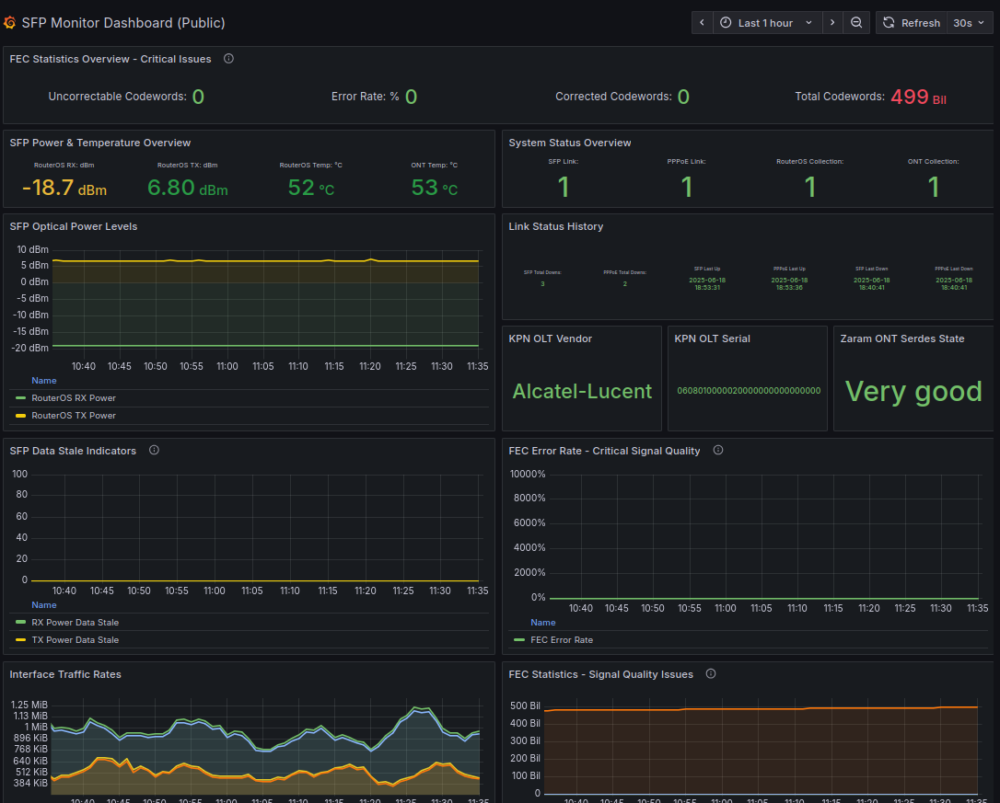

# Mikrotik SFP and PON Monitor

This script monitors SFP and PON (Passive Optical Network) metrics from a Mikrotik router with Zaram XGSPON SFP module and exports them to Prometheus. Then it will push it to Grafana Cloud with dashboards and alerts set up via Terraform deployment.

## Use Your Own ONT with KPN XGS-PON

This monitoring solution is particularly valuable for users who have chosen to use their own ONT (Optical Network Terminal) with KPN's XGS-PON network instead of the provided KPN equipment. While KPN supports using your own equipment, as documented in their [Eigen Apparatuur](https://www.kpn.com/service/eigen-apparatuur) guide, this comes with important considerations:

### Support Considerations

When using your own ONT, you may find yourself in situations where you need to request support from your provider due to various instability issues. Since users with their own ONT represent a niche in the Netherlands, you may be charged for support costs if the problem is determined to be on your end. This creates a challenging situation where you need to be able to prove that issues are not caused by your custom hardware.

**Provider Support Limitations:**
- **First-line support** is not always skilled to deal with custom ONT hardware as they expect standard KPN hardware to be used
- **Second-line support** usually has better knowledge but availability depends on the specific support team
- **Provider monitoring gaps**: KPN appears to be lacking comprehensive monitoring on their own OLT hardware to determine when issues fail on their end
- **Evidence requirements**: Having detailed metrics from your own monitoring becomes crucial to demonstrate that issues are not on your end
- **Support costs**: Support engineer is sent to your house and costs will be made; calls are free of charge.
- **Limited provider visibility**: KPN's monitoring systems may not provide sufficient detail about OLT-side issues

### Why Monitoring is Critical

To maintain better control and provide evidence when issues arise, this solution collects a comprehensive set of metrics focusing on:

- **SFP-SFPPPlus1 Interface**: Detailed monitoring of the SFP module's optical performance
- **PPPoE-WAN Interface**: Connection stability and performance metrics
- **Zaram XGS-PON SFP+ ONT**: Direct access to the ONT module for detailed diagnostics
- **OLT Side Insights**: Basic information about the provider's Optical Line Terminal

### Community Support

For users with their own ONT, the [Tweakers community](https://gathering.tweakers.net/forum/list_messages/2210482/0) has been invaluable. KPN employees have also contributed to discussions and assisted in connecting with vendors to make SFP modules ready (firmware) for KPN use. This is particularly important because specific requirements from the provider may not suit every XGS-PON SFP ONT module available on the market.

### Key Benefits

- **Proactive Monitoring**: Detect issues before they become critical
- **Evidence Collection**: Provide detailed metrics when contacting support - you can share a Grafana Cloud dashboard to share insights
- **Performance Optimization**: Identify and resolve performance bottlenecks
- **Cost Avoidance**: Demonstrate that issues are not on your end
- **Support Documentation**: Provide concrete data to support teams who may lack experience with custom ONT hardware

## Features

### SFP Monitoring
- **Signal Metrics**: RX/TX power levels, temperature, voltage, and bias current
- **Link Status**: Real-time monitoring of SFP link state and data freshness
- **Error Tracking**: Comprehensive SFP error statistics including:
  - FCS errors (RX/TX)
  - Collision errors (late, excessive)
  - Frame size errors (too short, too long, jabber)
  - Alignment and fragment errors
  - Buffer overflows and underruns
  - Deferred transmissions

### PON Monitoring
- **SerDes State**: Detailed PON link state information
- **FEC Statistics**: Forward Error Correction metrics
- **Performance Metrics**: Detailed optical performance data

### Integration
- **Prometheus Export**: All metrics available in Prometheus format
- **Grafana Dashboard**: Pre-configured for immediate visualization with no-hassle Terraform installation
- **Secure Storage**: Credentials managed via `pass` password manager

## Quick Start

### Prerequisites
- Linux server (tested on Ubuntu 22.04+)
- Python 3.8+
- `pass` password manager
- Mikrotik router with Zaram XGSPON SFP module

### Installation

## 1. Installation

### 1.1 Router Configuration

#### Enable API on RouterOS
```
/ip service
set api disabled=no
```

#### Create API User RouterOS
```
/user group
add name=api-monitoring policy=read,api,rest-api,!write

/user
add name=api-monitor group=api-monitoring password="secure_password"
```

#### Configure SSH Key Authentication
For secure SSH access to the router (required to then use telnet from RouterOS to SFP module), set up SSH key authentication:

**RouterOS UI Method (Alternative):**
1. Open RouterOS WebFig or WinBox
2. Navigate to **System** → **Users**
3. Select the user (e.g., `youruser`)
4. Go to the **SSH Keys** tab
5. Click **+** to add a new SSH key
6. Paste the public key content from your SSH key file (e.g., `~/.ssh/id_rsa.pub` or `~/.ssh/id_ed25519.pub`)
7. Click **OK** to save

### 1.2 Environment Configuration

1. **Copy the example environment file:**
   ```bash
   cp .env.example .env
   ```

2. **Edit the environment configuration:**
   ```bash
   vi .env
   ```

   Update the following variables with your specific values:
   ```bash
   # Router configuration
   ROUTER_HOST=your-router-ip
   ROUTER_USER=your-router-user
   
   # Zaram SFP telnet
   SFP_IP=192.168.200.1
   SFP_USER=admin
 
   ```

### 1.3 Service Setup and Verification

1. **Edit the preferred directory in the service file:**
   ```bash
   # Edit sfp-monitor.service and change yourdevelopmentdir to your preferred directory
   nano sfp-monitor.service
   ```

2. **Copy, reload, and start the service:**
   ```bash
   # Copy service file to user systemd directory
   mkdir -p ~/.config/systemd/user
   cp sfp-monitor.service ~/.config/systemd/user/
   
   # Reload and start the service
   systemctl --user daemon-reload
   systemctl --user enable --now sfp-monitor
   ```

3. **Check service status:**
   ```bash
   systemctl --user status sfp-monitor
   ```

4. **View logs:**
   ```bash
   journalctl --user -u sfp-monitor -f
   ```

5. **Test metrics endpoint:**
   ```bash
   # Test on localhost (if running locally)
   curl http://localhost:9700/metrics | grep sfp
   
   # Or test on your host IP (if accessing remotely)
   curl http://yourhostip:9700/metrics | grep sfp
   ```

## 2. Prometheus Configuration

To collect metrics from the SFP monitor, you need to configure Prometheus to scrape the metrics endpoint. You'll need a Prometheus server (preferably containerized) that can push data to Grafana Cloud's Prometheus endpoint.

### 2.1 Prometheus Server Setup

**Option 1: Docker Compose (Recommended)**
Create a `docker-compose.yml` file:

```yaml

services:
  prometheus:
    image: prom/prometheus:latest
    container_name: prometheus
    ports:
      - "9090:9090"
    volumes:
      - ./prometheus.yml:/etc/prometheus/prometheus.yml
      - prometheus_data:/prometheus
    command:
      - '--config.file=/etc/prometheus/prometheus.yml'
      - '--storage.tsdb.path=/prometheus'
      - '--web.console.libraries=/etc/prometheus/console_libraries'
      - '--web.console.templates=/etc/prometheus/consoles'
      - '--storage.tsdb.retention.time=200h'
      - '--web.enable-lifecycle'

volumes:
  prometheus_data:
```

**Option 2: System Package**
```bash
# Ubuntu/Debian
sudo apt update
sudo apt install prometheus

# Or download from https://prometheus.io/download/
```

### 2.2 Prometheus Configuration

Create or update your `prometheus.yml` configuration file:

```yaml
global:
  scrape_interval: 15s
  evaluation_interval: 15s

# Remote write to Grafana Cloud Prometheus
remote_write:
  - url: https://prometheus-us-central1.grafana.net/api/prom/push
    basic_auth:
      username: YOUR_USER#
      password: YOUR_GRAFANA_CLOUD_API_KEY_HERE

scrape_configs:
  # SFP Monitor metrics
  - job_name: 'mikrotik_sfp'
    scrape_interval: 30s
    scrape_timeout: 20s
    static_configs:
      - targets: ['yourlocalip_or_localhost:9700']
        labels:
          group: 'mikrotik_sfp'
```

**Configuration Details:**
- **Job Name**: `mikrotik_sfp` - Identifies the SFP monitoring job in Prometheus
- **Target**: `yourlocalup_or_localhost:9700` - The IP and port where the SFP monitor exposes metrics
- **Scrape Interval**: 30s - Matches the collection interval of the monitoring script
- **Scrape Timeout**: 20s - Allows sufficient time for metric collection
- **Labels**: `group: 'mikrotik_sfp'` - Helps organize metrics in Prometheus/Grafana
- **Remote Write**: Pushes metrics to Grafana Cloud Prometheus endpoint (not documented in detail here)

### 2.3 Grafana Cloud Configuration

To configure remote write to Grafana Cloud:

1. **Get your Grafana Cloud credentials:**
   - Go to your Grafana Cloud stack
   - Navigate to **Configuration** → **Prometheus**

### 2.4 Grafana Dashboards

This project includes two types of dashboards managed by Terraform:

1. **Internal Dashboard**: 
   - Located in the "RouterOS Monitoring/SFP Monitoring" folder
   - Full-featured dashboard with edit capabilities
   - Requires authentication
   - Contains detailed metrics and configuration options
   - URL: https://doemijdiemetriekmaar.grafana.net/d/sfp-monitor-11/sfp-monitor-dashboard

2. **Public Dashboard**:
   - Also located in the "RouterOS Monitoring/SFP Monitoring" folder
   - Read-only version accessible without authentication
   - Perfect for sharing with support teams or community members
   - Contains essential metrics for troubleshooting
   - URL: https://doemijdiemetriekmaar.grafana.net/public-dashboards/aepz11pasfcaof

Both dashboards are automatically deployed and managed through Terraform, ensuring consistent configuration and version control.

### 2.5 Dashboard Features

Both dashboards include:

- **SFP Module Metrics**:
  - Temperature monitoring
  - Voltage levels
  - TX/RX power levels
  - Bias current measurements

- **PON Statistics**:
  - Link status
  - SerDes state
  - FEC statistics
  - Error counters

- **Interface Status**:
  - Link state monitoring
  - Traffic statistics
  - Error rates

The internal dashboard additionally provides:
- Advanced configuration options
- Historical data analysis
- Alert management
- Custom annotations

## 3. Grafana Terraform Deployment

This project uses Terraform to deploy Grafana Cloud dashboards and alerts. The Terraform configuration is located in the `terraform/` directory.

**What Gets Deployed:**
- **Folder Structure**: 
  - "RouterOS Monitoring" as the root folder
  - "SFP Monitoring" subfolder containing dashboards and alerts
- **Dashboards**:
  - Internal dashboard with full monitoring capabilities
  - Public dashboard for sharing with support teams
- **Alert Configuration**:
  - Alert rules group in the SFP Monitoring folder
  - Contact points for notifications
  - Notification policies for alert routing

**Dashboard Organization:**
```
📁 RouterOS Monitoring
└── 📁 SFP Monitoring
    ├── 📊 SFP Monitor Dashboard (Internal)
    ├── 📊 SFP Monitor Dashboard (Public)
    └── 🚨 SFP Monitoring Alerts (rule group)
```

**Dashboard Access:**
- **Internal Dashboard**: https://doemijdiemetriekmaar.grafana.net/d/sfp-monitor-11/sfp-monitor-dashboard
  - Full-featured with edit capabilities
  - Requires authentication
  - Includes alert rules and advanced features
  
- **Public Dashboard**: https://doemijdiemetriekmaar.grafana.net/public-dashboards/aepz11pasfcaof
  - Read-only version
  - No authentication required
  - Perfect for sharing with support teams
  - Excludes sensitive information

**Alert Rules:**
- Located in the "RouterOS Monitoring/SFP Monitoring" folder
- Contains comprehensive alert rules for SFP monitoring
- Grouped under "SFP Monitoring Alerts" rule group
- Includes critical conditions, warnings, and system health checks


*Example of the SFP Monitor Dashboard as deployed via Terraform*

**Example Public Dashboard**: You can see what the deployed public dashboard looks like at: [https://doemijdiemetriekmaar.grafana.net/public-dashboards/70403c9943b74f8cb24f53539bf14a03](https://doemijdiemetriekmaar.grafana.net/public-dashboards/70403c9943b74f8cb24f53539bf14a03)

### 3.1 Prerequisites

- **Terraform** (version 1.0+)
- **Grafana Cloud API Key** with dashboard/alerts and folder permissions
- **Grafana Cloud Stack URL** (e.g., `https://your-stack.grafana.net`)

### 3.2 Configuration

1. **Copy the example configuration:**
   ```bash
   cp terraform/terraform.tfvars.example terraform/terraform.tfvars
   ```

2. **Edit the configuration file:**
   ```bash
   vi terraform/terraform.tfvars
   ```

   Update the following variables:
   ```hcl
   grafana_cloud_url = "https://your-stack.grafana.net"
   grafana_api_key   = "your-api-key"
   ```

### 3.3 Deploy Infrastructure

1. **Initialize Terraform:**
   ```bash
   cd terraform
   terraform init
   ```

2. **Plan the deployment:**
   ```bash
   terraform plan
   ```

3. **Apply the configuration:**
   ```bash
   terraform apply
   ```

### 3.4 What Gets Deployed

- **Dashboards**:
  - Internal dashboard with full monitoring capabilities
  - Public dashboard for sharing with support teams
- **Alert Configuration**:
  - Alert rules group in the SFP Monitoring folder
  - Contact points for notifications
  - Notification policies for alert routing

### 3.5 Terraform Files Structure

```
terraform/
├── main.tf                 # Main Terraform configuration
├── variables.tf            # Variable definitions
├── terraform.tfvars        # Your configuration values
├── providers.tf            # Provider configuration
└── modules/
    ├── alerts/            # Alert rules and policies
    │   ├── main.tf
    │   └── submodules/
    │       ├── alert-rules/
    │       ├── contact-points/
    │       └── notification-policies/
    ├── dashboards/        # Internal dashboard configuration
    │   ├── main.tf
    │   └── sfp-monitor-dashboard.json
    ├── dashboards-public/ # Public dashboard configuration
    │   ├── main.tf
    │   └── sfp-monitor-dashboard.json
    └── folders/           # Folder structure configuration
        └── main.tf
```

**Modular Structure:**
- **Folders Module**: Creates and manages the folder structure
  - RouterOS Monitoring (root folder)
  - SFP Monitoring (dashboards subfolder)
  - Alerts (alert rules subfolder)
- **Dashboards Module**: Manages the internal dashboard with full features
- **Dashboards-Public Module**: Manages the public, read-only dashboard
- **Alerts Module**: Contains all monitoring-related configurations
  - Alert rules for critical conditions
  - Contact points for notifications
  - Notification policies for alert routing

## 4. Troubleshooting

### Common Issues
1. **Connection Refused**: Ensure the SFP module's telnet interface is enabled and accessible
2. **Authentication Failed**: Verify credentials in the password store
3. **No Data**: Check if the SFP module is properly seated and recognized by the router

### Logs
Logs are stored in the `logs/` directory with rotation (5 files, 1MB each).

## License

This project is licensed under the MIT License - see the [LICENSE](LICENSE) file for details.